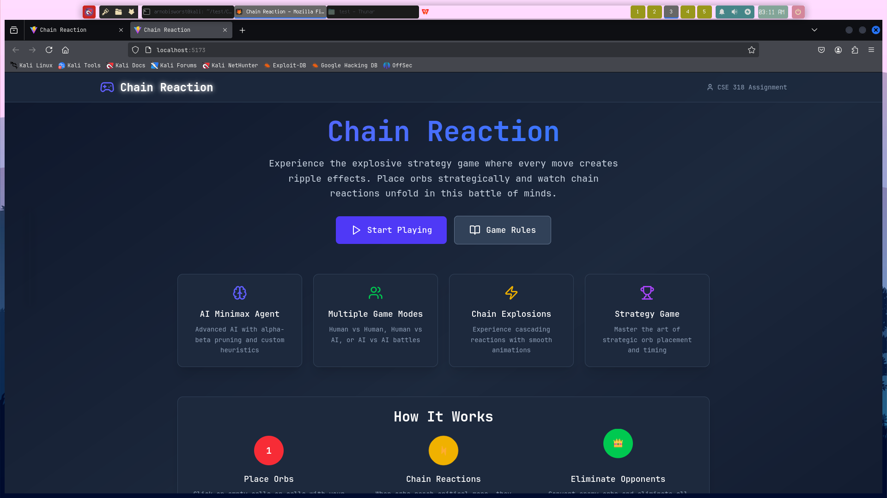

# Chain Reaction Game

A digital implementation of the Chain Reaction strategy game with AI opponents featuring different difficulty levels.

## Overview

Chain Reaction is a strategic, turn-based game where players place orbs in cells to gain control of the board. When a cell reaches its critical mass, it explodes and spreads to adjacent cells, potentially causing chain reactions. The game ends when one player eliminates all of the opponent's orbs.

This implementation features:
- Single-player against AI with multiple difficulty levels
- Two-player local gameplay
- AI vs AI simulation mode
- Various AI strategies and heuristics

## Screenshots



## Architecture

The project is split into two main components:
- **Frontend**: React-based UI built with Vite
- **Backend**: Python-based game logic with AI implementations

The two components communicate via a Node.js bridge server.

## Prerequisites

- Node.js (v14+)
- npm (v6+)
- Python (v3.8+)

Both the startup scripts (start-game.sh and start-game.bat) will check these requirements for you and provide helpful instructions if anything is missing.

## Installation and Setup

### 1. Clone the Repository

```bash
git clone https://github.com/Worston/CSE-318.git
cd CSE-318/offline_3/Chain-Reaction
```

### 2. Quick Setup (Recommended)

Run the appropriate startup script for your operating system. The script will automatically check requirements and install dependencies:

**On Linux/macOS:**
```bash
chmod +x start-game.sh  # Make the script executable (only needed first time)
./start-game.sh
```

**On Windows:**
```
start-game.bat
```

### 3. Manual Installation (Alternative)

If you prefer to install dependencies manually:

**Frontend Dependencies:**
```bash
cd Frontend
npm install
cd ..
```

**Backend Dependencies:**
No additional Python packages are required for the backend.

## Running the Game

### Option 1: Using the Startup Script (Recommended)

From the project root, simply run:

```bash
./start-game.sh
```

This will:
1. Check for required dependencies
2. Install necessary packages if needed
3. Start both the bridge server and frontend server
4. Open the game in your browser

### Option 2: Manual Startup

If you prefer to start components individually:

#### 1. Start the Bridge Server

From the project root:

```bash
cd Frontend
node bridge-server.js
```

You should see: `Bridge server running on http://localhost:3001`

#### 2. Start the Frontend Development Server

In a new terminal, from the project root:

```bash
cd Frontend
npm run dev
```

This will start the development server, typically at http://localhost:5173

### 3. Open the Game in Your Browser

Navigate to http://localhost:5173 in your web browser.

## How to Play

1. Choose a game mode (User vs User, User vs AI, or AI vs AI)
2. Configure the board size and AI difficulty if applicable
3. Click on cells to place your orbs
4. A cell explodes when it reaches its critical mass (2 for corners, 3 for edges, 4 for interior cells)
5. Win by eliminating all opponent orbs

## Game Modes

### User vs User
- Two players take turns placing orbs

### User vs AI
- Play against an AI opponent
- Three difficulty levels: Easy, Medium, Hard
- Various AI heuristics available

### AI vs AI
- Watch two AI opponents play against each other
- Configure different strategies and difficulties for each AI

## AI Strategies

### Random AI
- Makes random valid moves

### Smart AI (Minimax)
- Uses minimax algorithm with alpha-beta pruning
- Different heuristics:
  - Orb Count: Simply counts orbs
  - Explosion Potential: Focuses on chain reactions
  - Strategic Control: Values board position control
  - Growth Potential: Prioritizes safe expansion
  - Threat Analysis: Defensive play
  - Tempo: Focuses on initiative and forcing moves
  - Combined v2: Adaptive multi-heuristic approach

## Building for Production

To create a production build:

```bash
cd Frontend
npm run build
```

The build output will be in the `Frontend/dist` directory.

## Troubleshooting

### Common Issues

1. **Port Already in Use**
   - Error: `EADDRINUSE: address already in use :::3001` or similar
   - Solution: Another application is using port 3001 or 5173. Close other instances of the game or servers using these ports.

2. **Game State Issues**
   - If the game doesn't respond properly, try resetting the game state:
     - Close all instances of the servers
     - Restart the game using the startup script

3. **Bridge Server Connection Failed**
   - If you see "Failed to connect to bridge server" in the UI:
     - Make sure both servers are running
     - Check that there are no firewall issues blocking local connections
     - Try restarting both servers

4. **Browser Cache Issues**
   - If you see old or incorrect UI behavior:
     - Clear your browser cache
     - Try opening the game in an incognito/private browsing window

## Project Structure

```
Chain-Reaction/
├── Backend/               # Python game engine and AI
│   ├── bridge_mode.py     # Bridge between frontend and backend
│   ├── improved_chain_reaction.py  # Core game logic
│   └── ...
├── Frontend/              # React frontend
│   ├── src/               # React components and UI
│   ├── public/            # Static assets
│   ├── bridge-server.js   # Node.js bridge server
│   └── ...
├── start-game.sh          # Linux/macOS startup script
├── start-game.bat         # Windows startup script
└── ...
```

## Contributing

Contributions are welcome! Please see [CONTRIBUTING.md](CONTRIBUTING.md) for detailed guidelines on how to contribute to this project.

## License

[MIT](LICENSE)

## Acknowledgements

This project was developed as part of CSE 318 (Artificial Intelligence) course.
